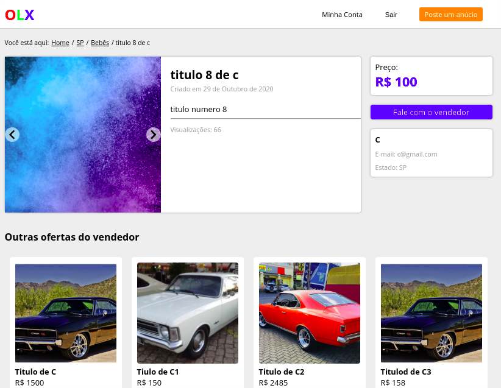
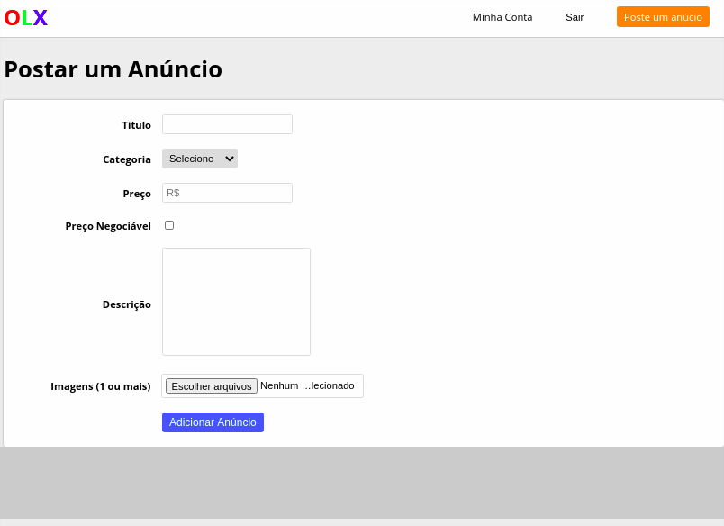
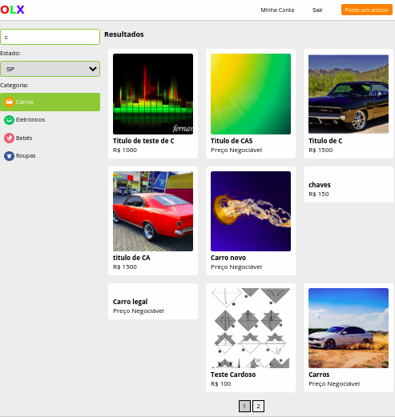
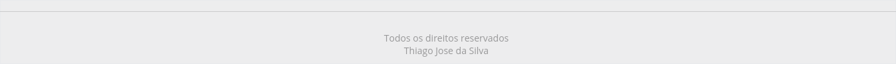

### Projeto clone do Olx, para treinamento da tecnologia <b>REACJS</b> (Parte FrontEnd)

- Dentro do <b>README</b> da pasta do projeto está tudo que foi ou está sendo usando.
https://github.com/thiagoadssilva/CloneFrontEndOlx/blob/master/README.md

## Tela <b>Principal</b> (Antes de fazer o login.)

## Tela dos <b>Detalhe</b> dos itens 

- Um detalhe interesante nessa tela foi uso do (slideShow), recurso top.
- Outra coisa foi o mapa da navegação das pagina informando ao usuáro de onde ele estava. (Na parte superior do lado esquerdo da pagina.)

## Tela do cadastro dos <b>Anúncios</b>

## Tela do <b>Filtro</b>

## finalização do <b>Rodapé</b>

